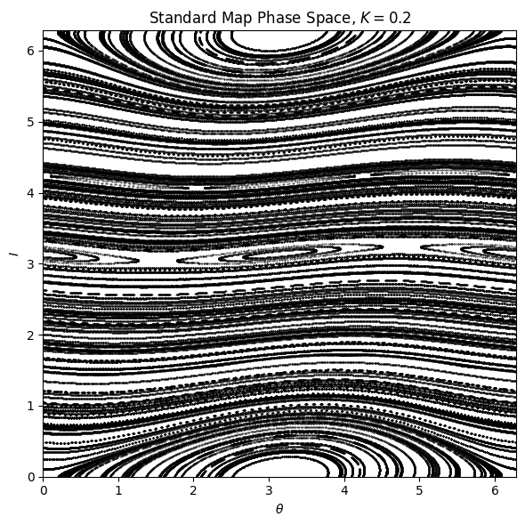
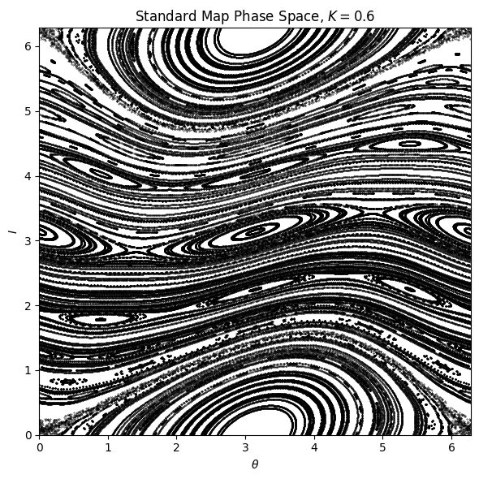
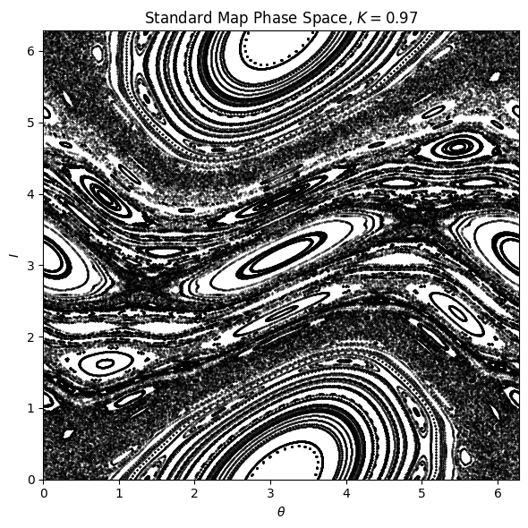
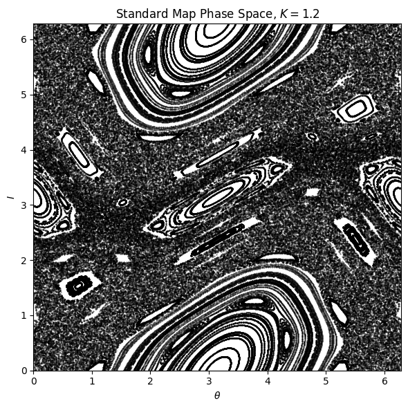
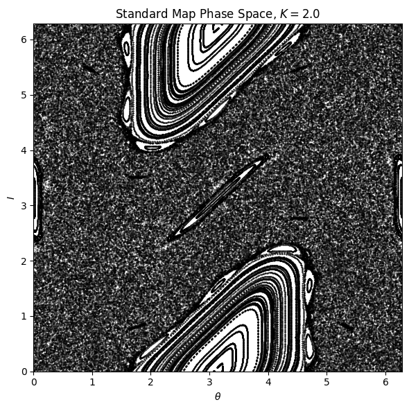
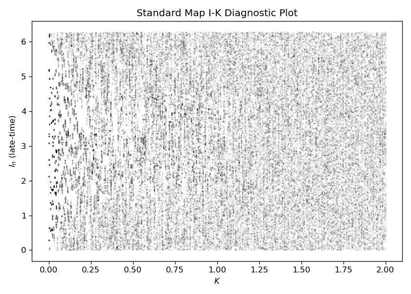

# Analyzing the Chaotic Behavior of the Chirikov-Taylor Map
### By: Nguyen Ly, Enrique Lopez, Carlos Solis, and Hazel Moore.

# Table of Contents
1. [Getting Started](#getting-started)
2. [Introduction](#introduction)
3. [The Standard Map](#the-standard-map)
4. [Properties](#properties)
5. [Working Examples](#working-examples)
6. [Current Code Structure](#current-code-structure-updated-12092025)
7. [Future Directions](#future-directions)
8. [References](#references)
9. [Credits](#credits)

# Getting Started

Follow these steps to set up your environment and install the required packages (NumPy, Matplotlib).

### 1. Clone the Repository

Open a terminal and run:
```bash
git clone https://github.com/ngly712/PHY329-Final-Project.git
cd PHY329-Final-Project
```

### 2. Create a new virtual environment

**Using venv:**
```bash
python3 -m venv map
source map/bin/activate  # On Windows use: map\Scripts\activate
```

**Or using conda:**
```bash
conda create -n map
conda activate map
```

### 3. Upgrade pip (recommended)
```bash
pip install --upgrade pip
```

### 4. Install Packages
```bash
pip install numpy
pip install matplotlib
```

### 5. Install the Project in Editable Mode (optional)

This repository comes with a `setup.py` file.

If you plan to modify the code and want changes to take effect immediately, run:
```bash
pip install -e .
```
This step is optional but recommended for development.


### 6. Import Relevant Modules

```python
import numpy as np
import matplotlib.pyplot as plt
from map.standardMap import StandardMap as sMap
from plots.mapEval import MapEvaluator as mEval
```

# Introduction

To a layperson, chaos is a “state of utter confusion” where “chance is supreme” [1]. In mathematics, however, chaos encapsulates the sensitive nature of systems entirely determined by mathematical laws. Dr. Robert L. Devaney introduced three main traits of chaotic systems: their sensitivity to initial conditions, topological transitivity, and dense periodic orbits [2].

## Sensitivity to Initial Conditions

The term “sensitivity” denotes how even a slight change in the initial conditions would yield dramatically different behavior. The "double pendulum" below is a classic example of this.


Sensitivity is numerically described by the Lyapunov exponents ($\lambda$), a set of parameters equal to the number of degrees of freedom in a dynamical system (the dimension of the phase space). The largest $\lambda$ of the spectrum denotes the dominant behavior of the system from a uniform perturbation of all $q_i$; a nonnegative value indicates chaos when the solution lies in a finite region as opposed to pure exponential growth.

Parallel to this definition is the Lyapunov time, the inverse of the largest Lyapunov exponent. This characteristic time scale denotes the minimum time before a system becomes chaotic [3].

## Topological Transivity

A system's “topological transitivity” refers to the impossibility of defining a clear boundary for the system's trajectory from a range of finite initial conditions. Formally, the mapping $f:X\to X$ is topologically transitive if, for any pair of non-empty open sets $U,V\in X$, there exists a positive $k$ such that $f^k(U)\cap V\neq \emptyset$. This means that any point in $U$ (assumed not to be in $V$) will eventually enter $V$ after being iterated upon by $f$ enough times. Therefore, defining any pair of separated open sets $U$ and $V$ is impossible [4].

<p align='center'>
<b>Topological mixing of the logistic map after six iterations</b> [7]
</p>


## Dense Periodic Orbits

Finally, a system has “dense periodic orbits” if a periodic orbit approaches every point in the system’s range arbitrarily closely [4]. The italicized terms emphasize that no path ever traces itself more than once, but it may trace over nearby points to form regions of attraction.

<p align='center'>
<b>Animation of the Lorentz Attrator</b> [8]
</p>


Sometimes, the presence of the last two traits implies sensitivity. A weaker sense of the definition uses only the first two traits to identify chaos in a system [5].

# The Standard Map

The Taylor-Greene-Chirikov Map, or Standard Map, is a two-dimensional discrete-time recurrence relation that exhibits chaotic behavior. The system is as follows [6]:

> <p align="center">
> $I_{n+1} = (I_n + K\sin\theta_n) \bmod 2\pi$
> </p>
> <p align="center">
> $\theta_{n+1} = (\theta_n + I_{n+1}) \bmod 2\pi$
> </p>

$I$ and $\theta$ are periodic real-valued variables within $[0, 2\pi)$, while $K$ is a nonnegative real number representing the kick value. The exact value of $K$ that results in chaotic behavior is not known, but several papers ([here](https://arxiv.org/pdf/2509.11593) and [here](https://pubs.aip.org/aip/jmp/article-abstract/20/6/1183/449401/A-method-for-determining-a-stochastic-transition?redirectedFrom=fulltext), for example) have attempted to identify a reasonable bound for the coefficient.

This chaotic mapping is surprisingly commonplace (hence the *Standard* moniker), appearing in:
- the dynamics of charged particles in mirror magnetic traps [9]
- the dynamics particle accelerators [10]
- the dynamics of Solar System comets [11]
- the microwave ionization of Rydberg atoms [12]
and much more.

## Properties [13]

The Standard Map is an **area-preserving** map due to the modulo functions, which means that the state variables can be mapped onto a torus. At low values of $K$, the invariant Kolmogorov-Arnold-Moser (KAM) curves are well-defined and prevent the momentum $I$ from taking on values beyond a certain "width" based on its initial value &mdash; thereby preventing chaotic behavior from appearing.

Beyond $K\approx 0.971635...$, the last KAM curve is destroyed, leading to "tori" or islands of stable orbits embedded in a densely-packed swath of chaos. As $K$ increases, the size of the islands shrink as the variation of $I$ is characterized by a diffusive growth patter: $I^2\simeq D_0t$, where $t$ is the number of iterations of the Standard Map.

# Working Examples

Please ensure that all modules have been imported in [step 6](#6-import-relevant-modules) before proceeding.

## Phase Space Plots

The following code will generate phase space plots for $K = 0.2, 0.6, 0.97, 1.2, 2.0$ and the corresponding CSVs.

```python
from plots.mapPlot import plot_phase_tail as pltTail

K_values = [0.2, 0.6, 0.97, 1.2, 2.0]

n_iters = 3500                   # Iterations per orbit
n_orbits = 200                   # Number of orbits per K (initial conditions)

# Create a StandardMap object
aMap = sMap(nIters = n_iters)    # K will be set in the loop

for K in K_values:
    aMap.K = K
    aMap.simulate(ic = n_orbits) # Append a run with this K to aMap.runs

aMap.write()                     # Save all of the runs as CSVs

mEval = mEval(aMap.runs)         # Create a MapEvaluator object

n_tail = 1000                    # Number of late-time points per orbit to plot

for idx, K in enumerate(K_values):
    title = rf"Standard Map Phase Space, $K = {K}$"

    plot_phase_tail(
        evaluator = mEval,
        run_idx = idx,
        n_tail = n_tail,
        point_size = 0.1,
        title = title,
    )
```











## Diagnostic Plots

```python
from plots.mapPlot import plot_IK_diagnostic as plotDiagS
# matplotlib defaults (optional for nicer plots)
plt.rcParams["figure.dpi"] = 120
plt.rcParams["axes.grid"] = False

# parameters for the IK diagnostic sweep
K_min = 0.0
K_max = 5.0
n_K   = 400           # number of K values
Ks    = np.linspace(K_min, K_max, n_K)

n_sim   = 10          # number of ICs at each K (each set of ICs produces one orbit)
n_iters = 5000        # iterations per orbit
n_tail  = 300         # tail length for diagnostic plot

# generate runs via StandardMap
aMap = sMap(K=Ks[0], nIters=n_iters, seed=seed)

for K in Ks:
    aMap.K = K
    aMap.simulate(ic=n_sim)

# wrap runs in a MapEvaluator
evaluator = mEval(aMap.runs)

plotDiagS(
    evaluator=evaluator,
    n_tail=n_tail,
    K_min=K_min,
    K_max=K_max,
    title="Standard Map I-K Diagnostic Plot",
    max_points=50000,    # subsample for readability
    point_size=0.1,
    alpha=0.3,
)
```



# Current Code Structure (Updated 12/09/2025)
```
map/
└── standardMap.py
└── StandardMap README.md
plots/
└── mapEval.py
└── mapPlot.py
└── Plots README.md
results/
└── csvs/
    └── K-0.2-len-x.csv
    └── K-0.6-len-x.csv
    └── K-0.97-len-x.csv
    └── K-1.2-len-x.csv
    └── K-2.0-len-x.csv
└── plots/
    └── K0.2.png
    └── K0.6.png
    └── K0.97.png
    └── K1.2.png
    └── K2.0.png
└── presentation/
    └── Chirikov-Taylor Map.pdf
└── tests/
    └── test_mapEvaluator.py
    └── test_standardMap.py
LICENSE
README.md
setup.py
```

The `map` folder contains the Standard Map simulator and its instruction manual.
- `standardMap.py` is the class that houses the Standard Map.
- `StandardMap README.md` provides guidance on how to use the command-line interface features of the class.

The `plots` folder contains utility functions for plotting the results of the simulator and an accompanying instruction manual.
- `mapEval.py` is the class that processes the data from the Standard Map class.
- `mapPlot.py` holds the plotting functions for the phase space plots and I–K diagnostic diagrams.
- `Plots README.md` provides more examples for generating plots.

The `results` folder houses the main outputs of this README's code. This is split into three subfolders:
- The `plots` subfolder has PNGs of the various plots.
- The `csvs` subfolder stores the raw data produced by the Standard Map class.
- The `presentation` folder is where the in-class presentation is located.

The `tests` folder contains unit tests for all Python files. These tests use the [PyTest](https://docs.pytest.org/en/stable/) module.
- `test_standardMap.py` is for the unit tests associated with the Standard Map class.
- `test_mapEvaluator.py` is for the unit tests associated with the evaluator class.

# Future Directions
In regards to code improvement, several changes would be favorable:
- merging the two classes into one to reduce the number of redundant variables
- adding support for other file formats (.xlsx, .txt, .bin)
- merging runs with identical kick values and RNG seeds
As for theoretical exploration, the following ideas arise:
- expand to the classical [kicked rotator](https://www.sciencedirect.com/science/article/pii/S0960077905005485?via%3Dihub) system upon which the Standard Map is derived
- apply the Standard Map to the physical examples listed [above](#the-standard-map)
- study the [Kolmogorov-Sinai Entropy](https://mathworld.wolfram.com/KolmogorovEntropy.html) of the system

# References

1. Merriam-Webster, "Chaos," retrieved April 3, 2025, https://www.merriam-webster.com/dictionary/chaos
2. Hasselblatt, Boris, Katok, Anatole, *A First Course in Dynamics: With a Panorama of Recent Developments*, (Cambridge University Press, 2003)
3. Weisstein, Eric W., "Lyapunov Characteristic Exponent," retrieved April 3, 2025, https://mathworld.wolfram.com/LyapunovCharacteristicExponent.html
4. Devaney, Robert L., *An Introduction to Chaotic Dynamical Systems* (2nd ed.), (Westview Press, 2003)
5. Medio, Alfredo, Lines, Marji, *Nonlinear Dynamics: A Primer*, (Cambridge University Press, 2001), p. 165
6. Weisstein, Eric W. "Standard Map." From MathWorld &mdash; A Wolfram Resource. https://mathworld.wolfram.com/StandardMap.html
7. N3kromancer732, CC BY-SA 4.0, https://creativecommons.org/licenses/by-sa/4.0, via Wikimedia Commons
8. Fincho64, CC BY-SA 4.0, https://creativecommons.org/licenses/by-sa/4.0, via Wikimedia Commons
9. B.V.Chirikov, "Resonance processes in magnetic traps", At. Energ. 6: 630 (1959).
10. F.M.Izraelev, "Nearly linear mappings and their applications", Physica D 1(3): 243 (1980).
11. T.Y.Petrosky, "Chaos and cometary clouds in the solar system", Phys. Lett. A 117(7): 328 (1986).
12. G.Casati, I.Guarneri, D.L.Shepelyansky, "Hydrogen atom in monochromatic field: chaos and dynamical photonic localization", IEEE J. of Quant. Elect. 24: 1420 (1988).
13. Boris Chirikov and Dima Shepelyansky (2008) Chirikov standard map. Scholarpedia, 3(3):3550.

# Credits
- Nguyen: `standardMap.py` class structure, utility functions, unit tests, front page README, and StandardMap README
    - helped with the in-class presentation
- Hazel: in-class presentation
- Enrique: `mapEval.py` class structure, utility functions, unit tests, and README plots
    - helped with the `mapPlot.py` script
- Carlos: `mapPlot.py` script
    - helped with the `mapEval.py` class structure

This started as a project for PHY 329 (Computational Physics) at UT Austin ([class website](https://www.wgilpin.com/cphy/)). The presentation we gave in-class on this repository is under `results/presentation`. Special thanks to Dr. William Gilpin (wgilpin@utexas.edu) for being an outstanding instructor and Alex Schmidt (alexcschmidt17@gmail.com) for being a supportive TA!
